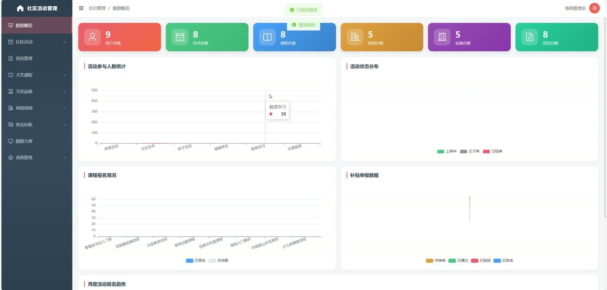
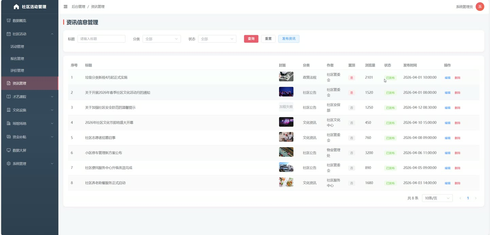
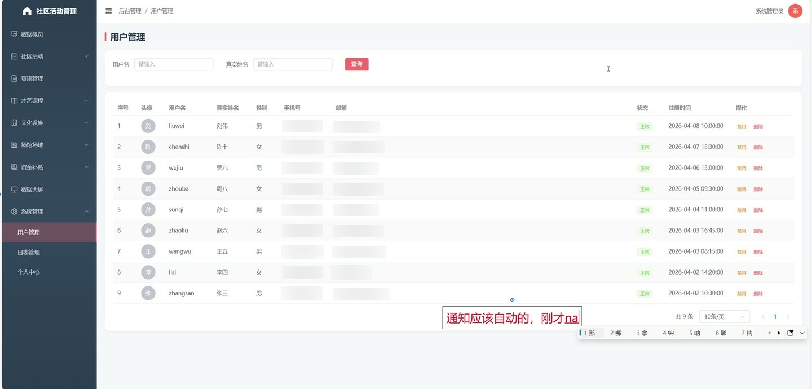

# (附文档)Springboot3+Vue3+MySQL 社区活动管理系统

**技术栈**：Springboot3、Vue3、MySQL

### 系统简介

社区活动管理系统是一套基于 Spring Boot 3 + Vue 3 前后端分离架构的社区综合服务平台。系统覆盖社区活动、才艺课程、文化设施、场馆场地、专项资金补贴等核心业务，提供用户端浏览报名、个人中心管理以及管理员端全量数据维护与审核能力，适用于社区服务中心、文化站等场景。
 
### 核心功能
 
### 普通用户端

 
- 查看社区活动列表（支持按标题/分类筛选），浏览活动详情（含封面、地点、时间、人数限制） 
- 在线报名活动，填写备注信息，系统自动校验是否已报名及人数上限 
- 取消已报名的活动（待审核或已通过状态可取消），报名人数自动回退 
- 查看我的活动报名记录（分页列表，含活动名称、状态、是否到场） 
- 对已参加的活动提交评价（评分 1-5 星 + 文字内容） 
- 查看我的活动评价列表，可查看管理员回复内容 
- 在线报名才艺课程（线上/线下），系统校验是否重复报名及名额 
- 取消已报名的课程（学习中或已完成状态可取消） 
- 查看我的课程列表，支持更新学习进度（百分比） 
- 浏览文化设施列表与详情（含位置、开放时间、使用规则） 
- 对文化设施提交评价（评分 + 文字）及反馈（问题描述） 
- 查看我的设施反馈记录及管理员处理回复 
- 在线预约场馆场地（选择日期、时段），提交预约申请 
- 取消未审核的场馆预约，查看我的预约记录及核销码 
- 浏览专项资金补贴项目列表与详情，查看供给主体信息 
- 在线提交补贴申报（填写申报材料），查看我的申报记录及审核结果 
- 查看我的消息通知列表（分页），支持单条标记已读和全部标记已读 
- 首页显示未读消息数角标 
- 注册新账号（用户名/密码/真实姓名/手机号等） 
- 登录系统，修改个人资料（真实姓名/手机号/邮箱等） 
- 修改登录密码（需验证旧密码） 
- 浏览社区资讯列表与详情（资讯详情页自动增加浏览量） 
- 查看授课导师列表（含姓名、专长、简介）
 
### 管理员端

 
- 数据大屏总览：统计用户总数、活动总数、课程总数、设施总数、场馆总数、预约总数等 
- 社区活动管理：分页查询活动列表（按标题/分类/状态筛选），新增/编辑/删除活动 
- 活动上下架操作（状态：下架/上架/已结束），查看活动详情 
- 活动报名管理：分页查询报名记录（按活动/状态筛选），审核报名（通过/拒绝），标记到场 
- 导出活动报名名单为 Excel 文件（含序号、活动名称、用户名、真实姓名、手机号、状态、是否到场、报名时间） 
- 活动评价管理：分页查询评价列表（按活动筛选），回复用户评价 
- 才艺课程管理：分页查询课程列表（按标题/类型/分类/状态筛选），新增/编辑/删除课程 
- 课程上下架操作，查看课程详情（含导师、课时、费用、上课时间） 
- 课程报名管理：分页查询课程报名记录（按课程/状态筛选） 
- 授课导师管理：分页查询导师列表（按姓名/专长筛选），新增/编辑/删除导师 
- 文化设施管理：分页查询设施列表（按名称/状态筛选），新增/编辑/删除设施 
- 设施评价管理：分页查询评价列表（按设施筛选），回复用户评价 
- 设施反馈管理：分页查询反馈列表（按设施/状态筛选），处理反馈（填写处理人、回复内容、处理状态） 
- 场馆场地管理：分页查询场馆列表（按名称/状态筛选），新增/编辑/删除场馆 
- 场馆上下架操作，查看场馆详情（含位置、开放时间、容纳人数） 
- 场馆预约管理：分页查询预约记录（按场馆/状态筛选），审核预约（通过/拒绝） 
- 预约核销管理：输入核销码进行核销，导出预约统计 Excel（含序号、场馆名称、用户名、真实姓名、手机号、预约日期、时段、状态、核销码、预约时间） 
- 专项资金补贴管理：分页查询补贴项目（按标题/分类/状态筛选），新增/编辑/删除项目 
- 供给主体管理：分页查询供给主体列表（按名称/类型筛选），新增/编辑/删除供给主体 
- 补贴申报管理：分页查询申报记录（按项目/状态筛选），审核申报（通过/拒绝并填写审核意见） 
- 用户管理：分页查询普通用户列表（按用户名/真实姓名筛选），启用/禁用用户，删除用户 
- 社区资讯管理：分页查询资讯列表（按标题/分类/状态筛选），发布/编辑/删除资讯 
- 系统日志管理：分页查询操作日志（按用户名/操作筛选），单条删除日志，一键清空全部日志
 
### 技术栈

 后端框架Spring Boot 3.x ORM 框架MyBatis-Plus 权限认证JWT Token（自定义注解 @Log 记录操作日志） 前端框架Vue 3 状态管理Pinia 构建工具Vite 数据库MySQL 8.x Excel 导出Apache POI 文件上传MultipartFile（本地存储）
 
### 交付内容

 
- 后端完整源码 
- 前端完整源码 
- 数据库初始化脚本 
- 万字文档

## 界面展示

---

## 获取完整源码 + 万字文档

本仓库为项目介绍页。**完整前后端源码、数据库初始化脚本、万字项目文档**，请加微信 `kangkangcode`，或访问 [codekk.top](http://codekk.top) 获取。

可作课程设计 / 毕业设计参考，支持远程部署调试。